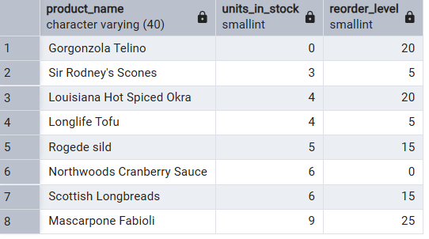
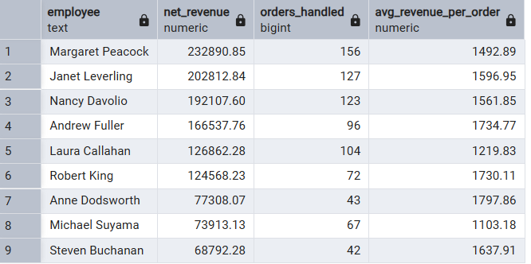
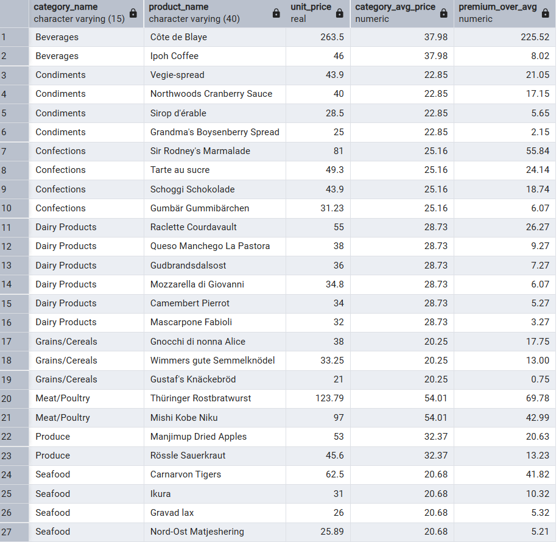
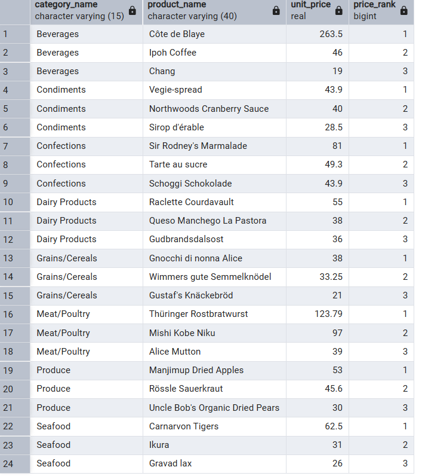
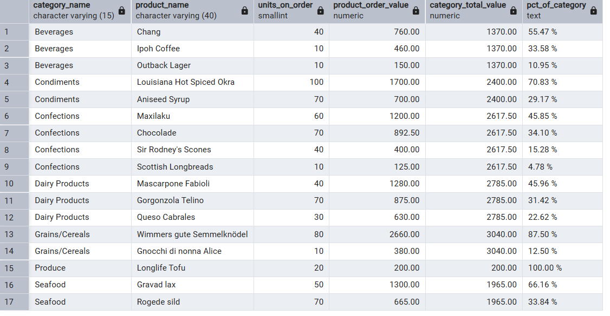
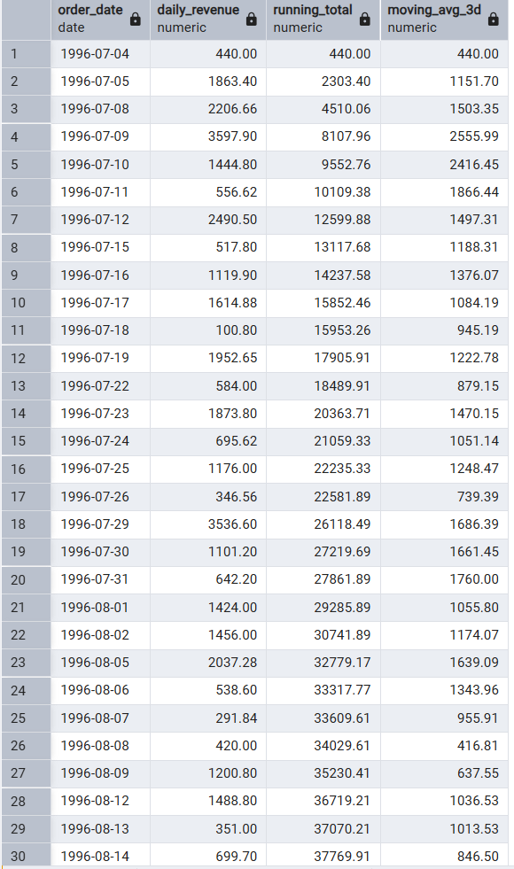

# Northwind SQL Business Intelligence

> **Six analytical queries that turn raw transactional data into decisions.**
> Built on the classic Northwind wholesale-food database using PostgreSQL.

---

## The Business Context

Northwind Traders is a classic SQL training database modelling 
a wholesale food distributor. This project goes beyond the data — 
each query answers a real operational question and ends with 
a concrete business recommendation.

| Area | Raw data available | Question that needs answering |
|---|---|---|
| **Operations** | Products table, stock levels | Which items are about to run out? |
| **Sales** | Employees, Orders, Order Details | Who is generating the most revenue — and how efficiently? |
| **Pricing** | Products, Categories | Are our premium products actually priced as premiums? |
| **Catalogue** | Products, Categories | What belongs in the "top tier" for marketing? |
| **Procurement** | Units on order, prices | Where is our supply-chain value concentrated? |
| **Finance** | Order dates, revenue | Is daily revenue trending up or down? |

Each query below addresses one of these questions end-to-end.

---

## Queries & Business Outcomes

### 1 · Inventory Reorder Alert

**Problem:** Stock-outs cause lost sales and erode customer trust.  The
procurement team needs a daily list of active products with fewer than 10 units
remaining so they can issue purchase orders before shelves empty.

**SQL approach:** Single-table filter on `products` (`discontinued = 0`,
`units_in_stock < 10`), ordered by urgency (lowest stock first).
`reorder_level` is included so buyers can compare actual stock against the
product's own threshold.

**Outcome / next step:** Any row returned = immediate purchase order.

---

### 2 · Sales Performance by Employee

**Problem:** Annual reviews and bonus calculations require fair, discount-
adjusted revenue figures per employee.  Gross revenue would overstate
performance for reps who approve large discounts.

**SQL approach:** Three-table JOIN (`employees → orders → order_details`).
Net revenue = `unit_price × quantity × (1 − discount)`.  Added
`orders_handled` and `avg_revenue_per_order` to separate volume from
efficiency — a rep closing many small orders looks different from one closing
few large ones.

**Outcome / next step:**
- Large gap between top and bottom performers → investigate 
  territory or product portfolio allocation.
- Low `avg_revenue_per_order` despite high order count → coaching on
  upselling or discount discipline.

---

### 3 · Above-Average Pricing by Category

**Problem:** Which products cost significantly more than others 
in their category? A high price is either justified by strong 
sales — or a pricing anomaly that could be hurting sales volume.

**SQL approach:** CTE (`CategoryAverage`) pre-calculates the mean price per
category.  Main query joins back to `products` and `categories`, exposes
`premium_over_avg` as a concrete currency figure rather than a ratio.

**Outcome / next step:**
- Large `premium_over_avg` → flag for category manager to justify 
  the price to buyers or investigate sales volume separately.
- Small `premium_over_avg` → product sits just above average, 
  pricing is likely healthy.
- Extreme outlier (e.g. Côte de Blaye +225 over average) → 
  requires individual business case review.

---

### 4 · Top-3 Products per Category (Premium Tier)

**Problem:** Marketing wants a "premium tier" catalogue list per category for
seasonal promotions and bundle design.  Ties must be handled fairly.

**SQL approach:** `DENSE_RANK()` inside a CTE ranks products 
by price descending, separately for each category. Unlike `RANK`, 
`DENSE_RANK` never skips a number after a tie — so both products 
get rank 2 and the next one gets rank 3, not rank 4. 
Outer query filters `<= 3`.

**Outcome / next step:**
- All 8 categories return exactly 3 products — the catalogue 
  is well-stocked across every segment.
- The top-3 list per category is ready to use for premium 
  promotions, gift sets, or loyalty programme rewards.

---

### 5 · Supply-Chain Concentration Risk

**Problem:** The purchasing director needs to know whether a single product
dominates the on-order value within its category.  Concentration = risk: if
that one supplier delays, the entire category is affected.

**SQL approach:** `SUM() OVER(PARTITION BY category_id)` calculates the
category total without collapsing rows, enabling a per-row percentage.
`NULLIF(…, 0)` prevents division-by-zero for categories with no open orders.
Only products with `units_on_order > 0` are included (active exposure only).

**Outcome / next step:**
- Product share > 60 % in its category → flag for dual-sourcing review or
  safety-stock increase.
- Balanced distribution (no single product above ~30 %) → lower risk profile,
  no immediate action needed.
- Produce (100%) and Grains/Cereals (87,50%) represent critical 
  single-product dependency — immediate dual-sourcing review recommended.

---

### 6 · Daily Revenue Trend (Running Total + Moving Average)

**Problem:** The CFO wants to distinguish genuine revenue trends from one-off
spikes and identify whether growth momentum is accelerating or decelerating —
before it shows up in monthly summaries.

**SQL approach:**
- **CTE** aggregates net revenue per calendar day.
- **Running total** (`SUM OVER ORDER BY order_date`) answers "how much have we
  earned so far this period?"
- **3-day moving average** (`AVG OVER … ROWS BETWEEN 2 PRECEDING AND CURRENT ROW`)
  smooths day-to-day noise while remaining responsive to real shifts.

**Outcome / next step:**
- `moving_avg_3d` rising consistently → revenue trend is healthy, 
  no action needed.
- `moving_avg_3d` falling while `running_total` still grows → 
  growth is slowing down, investigate before the monthly report.
- `daily_revenue` spike not reflected in `moving_avg_3d` 
  (e.g. 1996-07-09: 3,597 vs avg 2,555) → one-off large order, 
  do not adjust forecasts.

---

## Techniques Used

| Technique | Applied in query |
|---|---|
| Filtering & sorting | 1 |
| Multi-table JOIN + GROUP BY | 2 |
| CTE (Common Table Expression) | 3, 6 |
| DENSE_RANK() window function | 4 |
| SUM() OVER(PARTITION BY) | 5 |
| NULLIF (division-by-zero guard) | 2, 5 |
| Running total | 6 |
| Moving average (ROWS BETWEEN frame) | 6 |

---

## How to Run

1. Restore the Northwind database into PostgreSQL (search for "northwind postgresql" to find the setup scripts)..
2. Open `northwind_analysis.sql` in pgAdmin 4 or any PostgreSQL client.
3. Execute each section independently — queries are fully self-contained.

---

## Tech Stack

